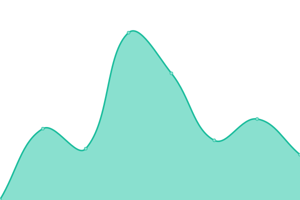
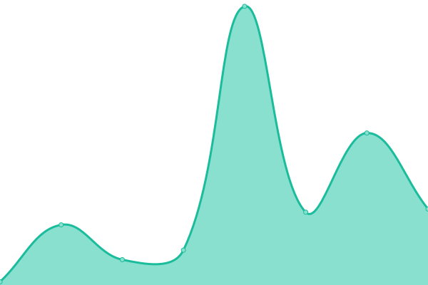

# [📈 Live Status](https://CityScope.github.io/CS_CityIO_uptime): <!--live status--> **🟩 All systems operational**

This repository contains the open-source uptime monitor and status page for [CityScope](http://cityscope.media.mit.edu/), powered by [Upptime](https://github.com/upptime/upptime).

With [Upptime](https://upptime.js.org), you can get your own unlimited and free uptime monitor and status page, powered entirely by a GitHub repository. We use [Issues](https://github.com/CityScope/CS_CityIO_uptime/issues) as incident reports, [Actions](https://github.com/CityScope/CS_CityIO_uptime/actions) as uptime monitors, and [Pages](https://CityScope.github.io/CS_CityIO_uptime) for the status page.

<!--start: status pages-->
<!-- This summary is generated by Upptime (https://github.com/upptime/upptime) -->
<!-- Do not edit this manually, your changes will be overwritten -->
<!-- prettier-ignore -->
| URL | Status | History | Response Time | Uptime |
| --- | ------ | ------- | ------------- | ------ |
|  [CityIO](https://cityio.media.mit.edu/) | 🟩 Up | [city-io.yml](https://github.com/CityScope/CS_CityIO_uptime/commits/HEAD/history/city-io.yml) | 

 402ms
     
 | 

<a href="https://CityScope.github.io/CS_CityIO_uptime/history/city-io">87.03%</a>
    

|  [CityScope](https://cityscope.media.mit.edu/) | 🟩 Up | [city-scope.yml](https://github.com/CityScope/CS_CityIO_uptime/commits/HEAD/history/city-scope.yml) | 

 30ms
     
 | 

<a href="https://CityScope.github.io/CS_CityIO_uptime/history/city-scope">100.00%</a>
    

|  [CityScope Editor](https://cityscope.media.mit.edu/CS_cityscopeJS/?editor) | 🟩 Up | [city-scope-editor.yml](https://github.com/CityScope/CS_CityIO_uptime/commits/HEAD/history/city-scope-editor.yml) | 

 27ms
     
 | 

<a href="https://CityScope.github.io/CS_CityIO_uptime/history/city-scope-editor">100.00%</a>
    

|  [CorkTown](https://cityscope.media.mit.edu/CS_cityscopeJS/?cityscope=corktown) | 🟩 Up | [cork-town.yml](https://github.com/CityScope/CS_CityIO_uptime/commits/HEAD/history/cork-town.yml) | 

 31ms
     
 | 

<a href="https://CityScope.github.io/CS_CityIO_uptime/history/cork-town">100.00%</a>
    

<!--end: status pages-->

[**Visit our status website →**](https://CityScope.github.io/CS_CityIO_uptime)

## 📄 License

- Powered by: [Upptime](https://github.com/upptime/upptime)
- Code: [MIT](./LICENSE) © [CityScope](http://cityscope.media.mit.edu/)
- Data in the `./history` directory: [Open Database License](https://opendatacommons.org/licenses/odbl/1-0/)
